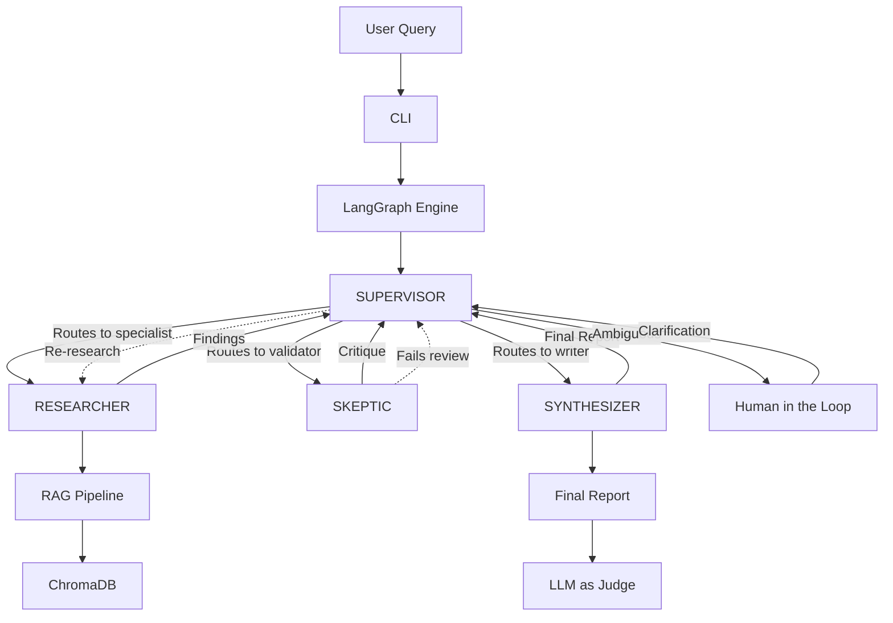
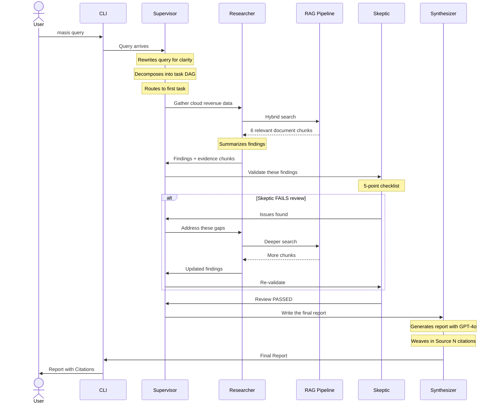
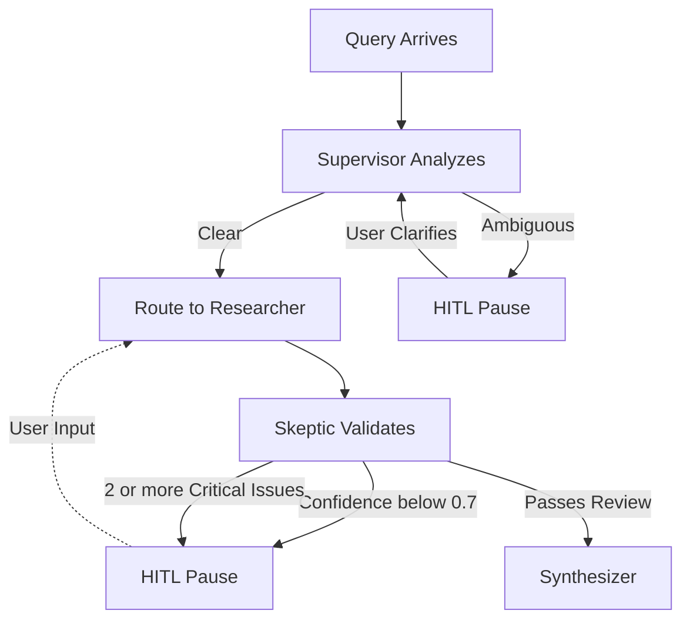
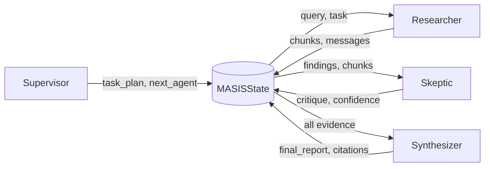
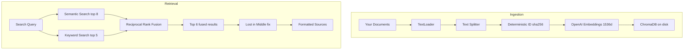
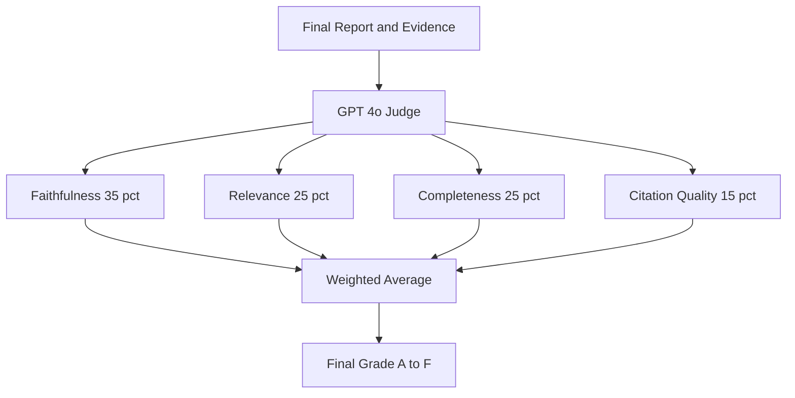
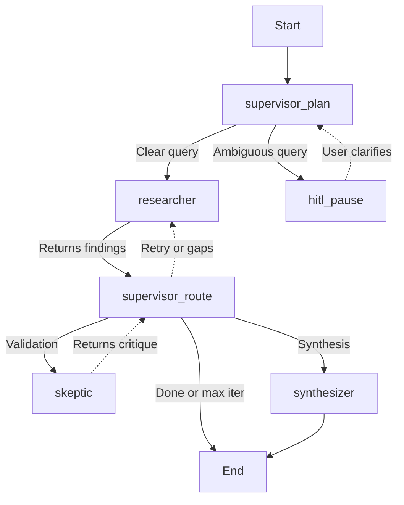
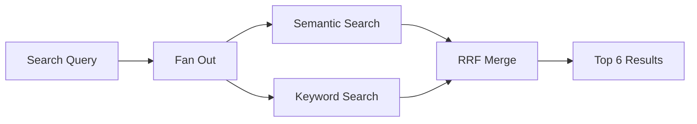
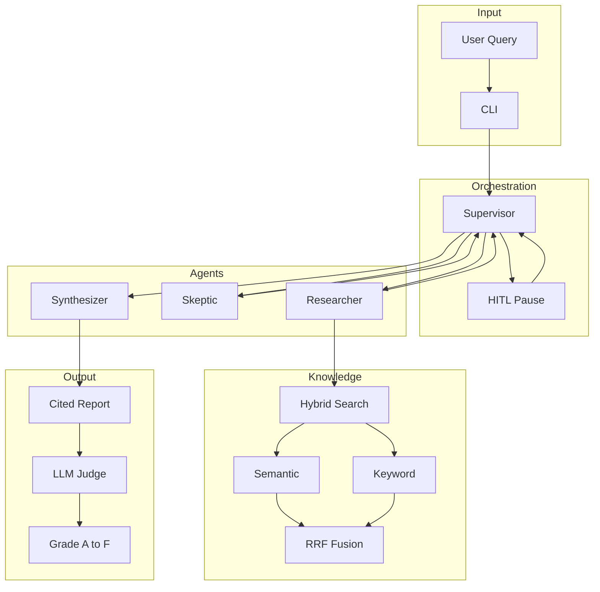

# MASIS — Multi-Agent Strategic Intelligence System

> A "Chief of Staff" AI that **reasons**, **validates**, and **justifies** outcomes through multi-agent orchestration with full citation traceability.

---

## Table of Contents

1. [What is MASIS?](#what-is-masis)
2. [Key Concepts (Beginner-Friendly)](#key-concepts-beginner-friendly)
3. [System Architecture](#system-architecture)
4. [How It Works — Step by Step](#how-it-works--step-by-step)
5. [I. High-Level Design (HLD)](#i-high-level-design-hld)
6. [II. Low-Level Design (LLD)](#ii-low-level-design-lld)
7. [III. Research & Justification](#iii-research--justification)
8. [IV. Evaluation Strategy](#iv-evaluation-strategy)
9. [Safety & Guardrails](#safety--guardrails)
10. [Project Structure](#project-structure)
11. [Quick Start Guide](#quick-start-guide)
12. [Sample Output](#sample-output)
13. [Configuration Reference](#configuration-reference)
14. [Confidence Aggregation Logic](#confidence-aggregation-logic)
15. [Parallel Task Execution](#parallel-task-execution)
16. [Observability & Tracing](#observability--tracing)
17. [Latency Optimization Strategy](#latency-optimization-strategy)
18. [Design Decisions & Trade-offs](#design-decisions--trade-offs)
19. [Full System Overview](#full-system-overview)
20. [Glossary](#glossary)

---

## What is MASIS?

Imagine you have a **Chief of Staff** — someone who:
- Reads all your company documents 📄
- Breaks your question into research tasks 📋
- Sends researchers to find evidence 🔍
- Has an auditor check for mistakes 🧐
- Writes a final report with citations ✍️
- Grades the quality of the answer 📊

MASIS does **exactly that**, but using AI agents working together automatically.

**Example:** You ask: *"What is Acme Corp's cloud revenue growth and what strategic options should they pursue?"*

MASIS will:
1. Read your Acme Corp documents
2. Plan 3–5 research tasks
3. Research each task using your documents
4. Check findings for errors and contradictions
5. Write a cited report with executive summary, analysis, and recommendations
6. Optionally grade itself with 4 quality metrics

---

## Key Concepts (Beginner-Friendly)

If you're new to AI/GenAI, here are the core ideas behind MASIS:

### What is an "Agent"?
An **agent** is an AI program that can make decisions and take actions autonomously. Unlike a simple chatbot that just answers questions, an agent can:
- Break a problem into steps
- Use tools (like searching a database)
- Check its own work
- Decide what to do next

MASIS has **4 agents**, each with a specific job (explained below).

### What is RAG (Retrieval-Augmented Generation)?
Instead of relying solely on what the AI model was trained on, **RAG** first *retrieves* relevant information from **your documents**, then gives that information to the AI to generate an answer. This means:
- The AI answers based on **your data**, not generic training data
- Every claim can be traced back to a specific document
- The AI is less likely to make things up (hallucinate)

### What is a "Hallucination"?
When an AI confidently states something that isn't true — like inventing statistics or citing documents that don't exist. MASIS has a dedicated **Skeptic agent** whose entire job is to catch hallucinations.

### What is LangGraph?
A Python framework for building AI workflows as **directed graphs** — where each node is an agent or action, and edges define the flow between them. MASIS uses LangGraph to wire its 4 agents into a loop that can retry, self-correct, and route dynamically.

### What is a Vector Database?
A database that stores text as mathematical vectors (lists of numbers representing meaning). When you search "revenue growth," it finds text chunks that are **semantically similar** — even if they don't use those exact words. MASIS uses **ChromaDB** as its vector database.

---

## System Architecture



### Architecture at a Glance

| Layer | Components | Purpose |
|-------|-----------|---------|
| **User Interface** | CLI (`masis query`, `masis ingest`) | Entry point for all interactions |
| **Orchestration** | LangGraph DAG + Supervisor | Plans tasks, routes agents, handles retries |
| **Agent Layer** | Researcher, Skeptic, Synthesizer | Specialist workers for research, validation, writing |
| **Knowledge Layer** | RAG Pipeline + ChromaDB | Document storage, hybrid search, context retrieval |
| **Quality Layer** | Citation Engine + Evaluator | Traceability, faithfulness scoring, grading |

---

## How It Works — Step by Step

Here's what happens when you run `masis query "What is Acme's cloud strategy?"`:



### The Self-Correction Loop (Key Feature)

The most important design feature: if the Skeptic agent finds problems, the system **automatically loops back** to fix them:

1. **Skeptic finds issues** → sets `passes_review = false`
2. **Supervisor detects failure** → creates new research tasks targeting the specific gaps
3. **Researcher re-investigates** → deeper search with gap-filling focus
4. **Skeptic re-validates** → checks if issues are resolved
5. **This repeats** up to 3 times (configurable), then proceeds with best available evidence

This means MASIS doesn't just generate — it **iterates toward correctness**.

---

## I. High-Level Design (HLD)

### Orchestration Strategy: Supervisor + DAG Hybrid

MASIS uses a **Hierarchical Supervisor pattern** combined with a **Directed Acyclic Graph (DAG)**:

```
               ┌──────────────────┐
               │   User Query     │
               └────────┬─────────┘
                        │
               ┌────────▼─────────┐
          ┌───►│   SUPERVISOR     │◄──────────────────┐
          │    │   (Plans, Routes, │                   │
          │    │    Monitors)      │                   │
          │    └──┬─────┬─────┬───┘                   │
          │       │     │     │                       │
          │  ┌────▼──┐ ┌▼────▼──┐ ┌────────────┐     │
          │  │RESEARC│ │SKEPTIC │ │SYNTHESIZER │     │
          │  │  HER  │ │        │ │            │     │
          │  └───┬───┘ └───┬────┘ └─────┬──────┘     │
          │      └─────────┴────────────┘             │
          │              │                            │
          │     ┌────────▼─────────┐                  │
          └─────┤  SUPERVISOR      ├──────────────────┘
                │  (Route/Retry)   │
                └────────┬─────────┘
                         │
               ┌─────────▼─────────┐
               │   Final Report    │
               │   + Citations     │
               │   + Audit Trail   │
               └───────────────────┘
```

**Why this pattern?**

| Pattern | What It Is | Why We Chose/Rejected It |
|---------|-----------|--------------------------|
| **Sequential Chain** | Agent A → B → C (fixed order) | ❌ Rejected: Can't retry, can't branch, no error recovery |
| **Hierarchical Supervisor** | Central manager delegates to workers | ✅ Chosen: Dynamic routing, retry logic, drift detection |
| **DAG (Directed Acyclic Graph)** | Tasks with dependency ordering | ✅ Combined: Task 3 waits for Tasks 1 & 2 to complete |
| **Supervisor + DAG** | Supervisor creates and traverses a task DAG | ✅ **Our choice**: Best of both worlds |

### Agent Personas

MASIS has 4 specialized agents, each with a clear role like members of a research team:

| Agent | Nickname | AI Model | What It Does | Analogy |
|-------|----------|----------|-------------|---------|
| **Supervisor** | The Brain | GPT-4o | Breaks your question into tasks, routes to specialists, monitors progress, retries on failure | **Project Manager** who assigns work and checks quality |
| **Researcher** | The Librarian | GPT-4o-mini | Searches your documents, retrieves evidence, summarizes findings, checks if evidence is sufficient | **Research Analyst** who digs through reports |
| **Skeptic** | The Auditor | GPT-4o | Checks every claim for errors, detects hallucinations, finds contradictions, assigns confidence score | **Quality Auditor** who questions everything |
| **Synthesizer** | The Writer | GPT-4o | Combines all findings into a polished report with executive summary, analysis, recommendations, and citations | **Executive Writer** who drafts the final memo |

### Self-Correction & Reflection

MASIS has three built-in self-correction mechanisms:

1. **Hallucination Detection**: The Skeptic runs a 5-point checklist against raw evidence. Claims without backing are flagged.
2. **Contradiction Resolution**: When documents disagree (e.g., CFO says "growth will continue" but CTO says "growth will slow"), both viewpoints are presented with sources.
3. **Iterative Refinement**: If the Skeptic rejects findings, the Supervisor automatically creates new research tasks targeting the specific gaps. Capped at 3 rounds.

### Human-in-the-Loop (HITL)

The system pauses and asks **you** for input when:
- The query is **ambiguous** (detected during planning)
- **Confidence drops** below 70%
- **2+ critical contradictions** that require human judgment

```
┌────────────────────────────────────────────────────────┐
│  🤚 Human Input Required                               │
│                                                        │
│  Reason: Query is ambiguous                            │
│  Context: "What is Acme's strategy?"                   │
│                                                        │
│  Question: Did you mean cloud strategy specifically    │
│  or the overall corporate strategy?                    │
│                                                        │
│  Your response: _______________                        │
└────────────────────────────────────────────────────────┘
```

### HITL Decision Flow



---

## II. Low-Level Design (LLD)

### Data Flow & State Management

All 4 agents share a single **whiteboard** — a Pydantic model called `MASISState`:

```python
class MASISState(BaseModel):
    # User query
    original_query: str              # What the user typed
    clarified_query: str             # After rewriting/HITL

    # Task planning (Supervisor)
    task_plan: TaskPlan              # DAG of sub-tasks
    current_task_id: str             # Which task is running now

    # Shared whiteboard (message passing)
    messages: list[AgentMessage]     # All agent messages (capped at 50)

    # Retrieved evidence (Researcher)
    retrieved_chunks: list[dict]     # Document chunks from RAG
    research_iterations: int         # How many search rounds

    # Critique (Skeptic)
    critique: CritiqueResult         # Pass/fail + issues list
    skeptic_rounds: int              # How many validation rounds

    # Output (Synthesizer)
    final_report: FinalReport        # The final cited report

    # Safety
    iteration_count: int             # Global step counter
    max_iterations: int = 15         # Hard ceiling to prevent infinite loops
```

**How agents communicate:**
1. Agent reads the current state
2. Agent does its work (search, critique, synthesize)
3. Agent writes its results back to the state
4. Supervisor reads the state and decides what to do next

**Context growth control** (prevents the state from growing too large):
- Messages capped at **50** (first 5 preserved + last 45)
- Evidence chunks truncated to **top-k** per retrieval
- Individual chunks capped at **500 characters** during critique
- Hard ceiling of **15 total iterations**

### State Flow Between Agents



### RAG Pipeline (How Documents Become Searchable)



#### Ingestion (What happens when you run `masis ingest`):
1. **Load** — Reads `.md`, `.txt`, `.pdf` files from your documents folder
2. **Split** — Breaks each document into ~1000-character chunks (with 200-char overlap so no information is lost at boundaries)
3. **ID** — Assigns a deterministic ID to each chunk using SHA-256 hash (same content always gets same ID)
4. **Embed** — Converts each chunk into a 1536-dimensional vector using OpenAI's `text-embedding-3-small` model
5. **Store** — Saves vectors to ChromaDB on disk for fast retrieval later

#### Retrieval (What happens during every query):
1. **Semantic search** — Finds the 8 most meaning-similar chunks (even if different words are used)
2. **Keyword search** — Finds the 5 best chunks containing exact terms
3. **Reciprocal Rank Fusion (RRF)** — Merges both result sets using a scoring formula: `score = 1 / (k + rank)` with `k=60`
4. **Lost-in-the-middle mitigation** — Reorders chunks so the most relevant ones are at the start and end of the context (LLMs tend to forget what's in the middle)
5. **Formatting** — Numbers each chunk as `[Source 1]`, `[Source 2]`, etc. for citation tracing

### Tooling Matrix (What Each Agent Can Access)

| Tool | Supervisor | Researcher | Skeptic | Synthesizer |
|------|:----------:|:----------:|:-------:|:-----------:|
| LLM (GPT-4o) | ✅ | | ✅ | ✅ |
| LLM (GPT-4o-mini) | | ✅ | | |
| Hybrid Search (RAG) | | ✅ | | |
| Vector DB (ChromaDB) | | ✅ | | |
| Structured Output (Pydantic) | ✅ | | ✅ | |
| Citation Engine | | | | ✅ |
| Rate Limiter | ✅ | ✅ | ✅ | ✅ |

**Key design choice**: The Skeptic has **no search access** — it can only judge what the Researcher found. This is like a financial auditor who reviews submitted evidence but can't go create their own — preventing cherry-picking.

---

## III. Research & Justification

### Model Selection

| Task | Model | Cost per 1M tokens | Why This Model |
|------|-------|:---:|----------------|
| Query decomposition & routing | **GPT-4o** | ~$2.50 | Requires complex reasoning about task dependencies |
| Evidence summarization | **GPT-4o-mini** | ~$0.15 | Simpler extraction task; **16× cheaper** |
| Hallucination detection | **GPT-4o** | ~$2.50 | Critical safety task — accuracy matters more than cost |
| Final report synthesis | **GPT-4o** | ~$2.50 | High-stakes output; quality is paramount |
| Evaluation (LLM-as-Judge) | **GPT-4o** | ~$2.50 | Judge must be at least as capable as generator |
| Document embeddings | **text-embedding-3-small** | ~$0.02 | Best cost/performance ratio for retrieval |

**Key insight**: The Researcher uses GPT-4o-mini because summarizing retrieved chunks doesn't need deep reasoning — saving **16× on cost** for the most-called agent.

### Framework Choice: Why LangGraph?

| Framework | Strengths | Weaknesses | Verdict |
|-----------|----------|-----------|---------|
| **LangGraph** | Native DAG support, typed state (Pydantic), conditional routing, HITL interrupts, LangSmith tracing | Steeper learning curve | ✅ **Selected** |
| **CrewAI** | Easy agent definitions, built-in roles | Sequential by default, limited state control, opinionated | ❌ No native DAG |
| **AutoGen** | Good for multi-agent chat | Chat-centric (not task DAG), complex setup | ❌ Wrong paradigm |
| **Custom** | Full control | Build everything from scratch, no observability | ❌ Maintenance burden |

**LangGraph was chosen because it's the only framework that natively supports all requirements**: DAG orchestration + typed state + conditional edges + human-in-the-loop + self-correction loops + built-in observability.

---

## IV. Evaluation Strategy

### LLM-as-a-Judge

After generating a report, MASIS can **grade its own output** using GPT-4o as an impartial judge:



### Core Metrics Explained

| Metric | Weight | What It Checks | Example |
|--------|:------:|---------------|---------|
| **Faithfulness** | 35% | Is every claim backed by evidence? No hallucinations? | "Revenue grew 28%" ← must appear in source documents |
| **Relevance** | 25% | Does the answer match what the user asked? | If asked about "cloud strategy," don't talk about HR policy |
| **Completeness** | 25% | Are ALL parts of the question addressed? | If asked "growth AND strategy," both must be covered |
| **Citation Quality** | 15% | Are claims properly linked to sources? | Every stat should have a `[Source N]` reference |

**Faithfulness is weighted highest (35%)** because hallucinations are the #1 risk in AI-generated analysis.

### Grading Scale

| Grade | Score | Meaning | Action |
|:-----:|:-----:|---------|--------|
| **A** | ≥ 90% | Excellent — production ready | Ship it |
| **B** | ≥ 80% | Good — minor improvements possible | Review citations |
| **C** | ≥ 70% | Adequate — needs improvement | Check for gaps |
| **D** | ≥ 60% | Below standard | Re-run with better docs |
| **F** | < 60% | Failing — unreliable | Do not use |

### How It's Used

```bash
# Run query WITH evaluation
masis query "Analyze Acme's Q3 performance" --evaluate

# Output includes:
# ┌──────────── Evaluation: Grade A ────────────┐
# │ Overall: A (97.0%)                           │
# │ Faithfulness: 100.0%                         │
# │ Relevance:    100.0%                         │
# │ Completeness: 100.0%                         │
# │ Citations:     80.0%                         │
# └──────────────────────────────────────────────┘
```

---

## Safety & Guardrails

MASIS has **7 layers of protection** to prevent runaway AI behavior:

| # | Guardrail | What It Prevents | Implementation |
|:-:|-----------|-----------------|----------------|
| 1 | **Max iterations = 15** | Infinite loops | Hard ceiling on total graph steps |
| 2 | **Max research iterations = 5** | Endless searching | Researcher stops after 5 rounds |
| 3 | **Max skeptic challenges = 3** | Infinite critique loops | Skeptic can reject at most 3 times |
| 4 | **Rate limiter (60 RPM)** | Exceeding API limits / cost explosion | Thread-safe sliding window limiter |
| 5 | **Retry with exponential backoff** | API failures crashing the pipeline | Tenacity: 3 attempts, 2–30s backoff |
| 6 | **Message cap (50)** | Context window overflow | First 5 + last 45 messages kept |
| 7 | **Agentic drift detection** | AI going off-topic | Supervisor anchors all tasks to original query |

### LangGraph State Machine (Internal Decision Logic)



---

## Project Structure

```
MultiAgent Strategic Intelligence System/
│
├── masis/                          # Main package
│   ├── __init__.py
│   ├── config.py                   # Central configuration (env vars → Pydantic settings)
│   ├── schemas.py                  # All data models (DocumentChunk, Citation, TaskPlan, etc.)
│   ├── state.py                    # MASISState — the shared whiteboard
│   ├── llm_utils.py                # Model factory, rate limiter, retry logic
│   ├── rag.py                      # RAG pipeline (ingest, search, hybrid retrieval)
│   ├── graph.py                    # LangGraph DAG wiring (nodes + edges + routing)
│   ├── citation_engine.py          # Citation validation & audit
│   ├── hitl.py                     # Human-in-the-loop handler
│   ├── evaluation.py               # LLM-as-Judge evaluation framework
│   ├── cli.py                      # CLI entry point (masis query / masis ingest)
│   └── agents/                     # Agent implementations
│       ├── __init__.py
│       ├── supervisor.py           # "The Brain" — planning & routing
│       ├── researcher.py           # "The Librarian" — evidence gathering via RAG
│       ├── skeptic.py              # "The Auditor" — hallucination & logic validation
│       └── synthesizer.py          # "The Writer" — final report with citations
│
├── data/
│   └── documents/                  # Place your source documents here
│       ├── acme_q3_2025_report.md  # Sample: Acme Q3 financials
│       ├── acme_strategic_review.md # Sample: Strategic options analysis
│       └── cloud_market_analysis_2025.md # Sample: Cloud market data
│
├── tests/
│   └── test_unit.py                # Unit tests (no API key required)
│
├── .env.example                    # Template for environment variables
├── .env                            # Your actual config (not committed to git)
├── pyproject.toml                  # Python project metadata & dependencies
└── README.md                       # This file
```

### File-by-File Breakdown

| File | Purpose | Key Classes/Functions |
|------|---------|----------------------|
| `config.py` | All configuration in one place | `ModelConfig`, `RAGConfig`, `AgentConfig`, `get_config()` |
| `schemas.py` | Every data object agents pass around | `DocumentChunk`, `Citation`, `SubTask`, `TaskPlan`, `CritiqueResult`, `FinalReport` |
| `state.py` | The shared whiteboard flowing through the graph | `MASISState`, `_merge_messages()` |
| `llm_utils.py` | Model creation + rate limiting + retry | `RateLimiter`, `get_primary_llm()`, `invoke_llm()`, `invoke_llm_structured()` |
| `rag.py` | Document ingestion + hybrid search | `ingest_documents()`, `hybrid_search()`, `format_context()` |
| `graph.py` | Wires all agents into a LangGraph DAG | `build_graph()`, `run_masis()`, routing functions |
| `supervisor.py` | Query decomposition + task routing | `supervisor_plan()`, `supervisor_route()`, `_find_next_task()` |
| `researcher.py` | Evidence gathering via RAG | `researcher_node()` |
| `skeptic.py` | 5-point critique with structured output | `skeptic_node()` |
| `synthesizer.py` | Report generation + citation building | `synthesizer_node()`, `_build_citations()` |
| `citation_engine.py` | Citation validation + orphan detection | `CitationEngine`, `CitationAudit` |
| `hitl.py` | Human pause/resume via Rich CLI prompts | `handle_hitl_request()`, `should_trigger_hitl()` |
| `evaluation.py` | 4-metric LLM-as-Judge framework | `MASISEvaluator`, `MetricScore`, `EvaluationResult` |
| `cli.py` | Beautiful CLI with Rich tables and panels | `_run_query()`, `_ingest_docs()`, `_print_report()` |

---

## Quick Start Guide

### Prerequisites
- **Python 3.10+** installed
- **OpenAI API key** (get one at https://platform.openai.com/api-keys)

### Step 1 — Open terminal in the project folder

```powershell
cd "c:\Users\punit\OneDrive\Desktop\MultiAgent Strategic Intelligence System"
```

### Step 2 — Create virtual environment

```powershell
python -m venv .venv
```

### Step 3 — Activate it

```powershell
# Windows PowerShell:
.\.venv\Scripts\Activate.ps1

# If you get execution policy error:
Set-ExecutionPolicy -ExecutionPolicy RemoteSigned -Scope CurrentUser
```

### Step 4 — Install MASIS

```powershell
pip install -e .
```

This installs all dependencies: `langgraph`, `langchain`, `langchain-openai`, `chromadb`, `pydantic`, `rich`, `tenacity`, etc.

### Step 5 — Configure API key

```powershell
Copy-Item .env.example .env
```

Edit `.env` and replace the placeholder:
```
OPENAI_API_KEY=sk-proj-your-actual-key-here
```

### Step 6 — Ingest your documents

```powershell
masis ingest --dir ./data/documents
```

Expected output:
```
Ingesting documents from: data\documents
⠏ Done!
Ingested 6 chunks into the vector store.
```

### Step 7 — Run a query

```powershell
masis query "What is Acme Corp's cloud revenue growth and what strategic options should they pursue?"
```

### Step 8 — Run with evaluation

```powershell
masis query "Analyze Acme's Q3 performance and competitive position" --evaluate
```

### Step 9 — Run unit tests (no API key needed)

```powershell
pip install -e ".[dev]"
pytest tests/ -v
```

---

## Sample Output

When you run a query, MASIS produces output like this:

```
╭──────────────── MASIS Query ─────────────────╮
│ Analyze Acme's Q3 performance and            │
│ competitive position                          │
╰───────────────────────────────────────────────╯

╭──────────────── Executive Summary ────────────╮
│ Acme Corporation's Q3 2025 revenue increased  │
│ 12% to $2.3B, driven by cloud services        │
│ growing 28% to $890M [Source 4]. Hardware     │
│ declined 8%. Cloud market share rose from     │
│ 3.5% to 4.2% [Source 1].                     │
╰───────────────────────────────────────────────╯

╭──────────────── Detailed Analysis ────────────╮
│ Cloud services outpaced market average of     │
│ 22%, with 94.2% customer retention [Source 4].│
│ Internal forecasts suggest growth may slow to │
│ 18-20% by mid-2026 [Source 2], contrasting    │
│ with CFO's optimistic guidance [Source 1].    │
╰───────────────────────────────────────────────╯

Recommendations:
  1. Increase R&D investment in cloud services
  2. Expand into European markets
  3. Enhance strategic partnerships
  4. Address hardware division challenges

┌──────────── Citation Trail ───────────────────┐
│ ID          │ Claim              │ Source      │
├─────────────┼────────────────────┼────────────┤
│ cite-ad26e3 │ 28% cloud growth   │ acme_q3... │
│ cite-858173 │ Hardware declined  │ acme_str...│
│ cite-d931c4 │ Market share 4.2%  │ cloud_ma...│
└─────────────┴────────────────────┴────────────┘

Confidence: LOW | Research iterations: 4 | Skeptic rounds: 2

╭──────────── Evaluation: Grade A ──────────────╮
│ Overall: A (97.0%)                             │
│ Faithfulness: 100% | Relevance: 100%          │
│ Completeness: 100% | Citations: 80%           │
╰────────────────────────────────────────────────╯
```

---

## Configuration Reference

All configuration lives in `.env` (loaded automatically):

| Variable | Default | What It Controls |
|----------|---------|-----------------|
| `OPENAI_API_KEY` | *(required)* | Your OpenAI API key |
| `PRIMARY_MODEL` | `gpt-4o` | Model for Supervisor, Skeptic, Synthesizer, Evaluator |
| `SECONDARY_MODEL` | `gpt-4o-mini` | Model for Researcher (cheaper, faster) |
| `CHROMA_PERSIST_DIR` | `./data/chroma_db` | Where ChromaDB stores vectors on disk |
| `DOCUMENT_DIR` | `./data/documents` | Where to find your source documents |
| `CHUNK_SIZE` | `1000` | Characters per document chunk |
| `CHUNK_OVERLAP` | `200` | Overlap between consecutive chunks |
| `MAX_RESEARCH_ITERATIONS` | `5` | Max times the Researcher can search |
| `MAX_SKEPTIC_CHALLENGES` | `3` | Max times the Skeptic can reject findings |
| `CONFIDENCE_THRESHOLD` | `0.7` | Below this, triggers Human-in-the-Loop |
| `RATE_LIMIT_RPM` | `60` | API requests per minute cap |
| `HITL_ENABLED` | `true` | Whether to pause for human input |
| `HITL_TIMEOUT_SECONDS` | `300` | How long to wait for human response |
| `LANGCHAIN_TRACING_V2` | `false` | Enable LangSmith tracing (set to `true`) |
| `LANGCHAIN_API_KEY` | *(optional)* | LangSmith API key for tracing |
| `LANGCHAIN_PROJECT` | `masis` | LangSmith project name |

---

## Confidence Aggregation Logic

MASIS computes a **final confidence score** using an explicit weighted formula that combines three independent signals:

```
final_confidence = 0.60 * skeptic_confidence
                 + 0.25 * citation_ratio
                 + 0.15 * evidence_coverage
```

| Signal | Weight | Source | What It Measures |
|--------|:------:|--------|------------------|
| **skeptic_confidence** | 60% | Skeptic agent's `CritiqueResult.confidence_score` | How well claims survive hallucination & logic checks |
| **citation_ratio** | 25% | `len(citations) / len(retrieved_chunks)` | What fraction of claims have `[Source N]` references |
| **evidence_coverage** | 15% | `unique_cited_chunks / total_chunks` | How much of the retrieved evidence is actually used |

### Mapping to Confidence Levels

| Score Range | Level | Action |
|:-----------:|:-----:|--------|
| >= 0.8 | **HIGH** | Ship it |
| >= 0.5 | **MEDIUM** | Review recommended |
| < 0.5 | **LOW** | Triggers HITL if enabled |

The breakdown is included in the report metadata:

```json
"confidence_breakdown": {
    "skeptic_confidence": 0.85,
    "citation_ratio": 0.667,
    "evidence_coverage": 0.500,
    "final_score": 0.752
}
```

**Why these weights?** Skeptic validation (60%) is dominant because it directly catches hallucinations — the highest-risk failure mode. Citation ratio (25%) ensures claims are traceable. Evidence coverage (15%) penalizes reports that ignore most retrieved context.

---

## Parallel Task Execution

MASIS uses **parallel fan-out** where independent operations can execute concurrently:

### Hybrid Search Parallelism

The RAG pipeline's `hybrid_search()` runs semantic and keyword searches **simultaneously** using `ThreadPoolExecutor`:

```python
# Fan-out: both searches run concurrently
with ThreadPoolExecutor(max_workers=2) as pool:
    sem_future = pool.submit(semantic_search, query)
    kw_future  = pool.submit(keyword_search, query)
    semantic_results = sem_future.result()
    keyword_results  = kw_future.result()
# Fan-in: merge via Reciprocal Rank Fusion
```



### Scalability Path

The current architecture supports future parallelism at additional levels:

| Level | Current | Future |
|-------|---------|--------|
| **Hybrid search** | Parallel (semantic + keyword) | Already implemented |
| **Independent sub-tasks** | Sequential via Supervisor routing | Parallel fan-out of Researcher nodes for independent tasks |
| **Multi-document ingestion** | Sequential per file | Parallel chunking + embedding per file |
| **Evaluation metrics** | Sequential (4 LLM calls) | Parallel metric evaluation |

LangGraph natively supports parallel node execution via **fan-out/fan-in** edges, making the Supervisor route to multiple Researchers concurrently when sub-tasks have no dependencies.

---

## Observability & Tracing

MASIS includes a production-grade observability layer for monitoring, debugging, and performance analysis.

### Structured Logging

Every LLM call and graph node is instrumented with structured logs:

```
14:32:01 | masis | INFO | Node [supervisor_plan] started | iteration=0
14:32:03 | masis | INFO | LLM call completed: model=gpt-4o latency=2.14s tokens=...
14:32:03 | masis | INFO | Node [supervisor_plan] completed | latency=2.31s
14:32:03 | masis | INFO | Node [researcher_node] started | iteration=1
14:32:04 | masis | INFO | LLM call completed: model=gpt-4o-mini latency=1.22s tokens=...
```

Enable verbose (DEBUG) logging:

```bash
masis --verbose query "Your question here"
```

### LangSmith Tracing

For production observability, MASIS integrates with **LangSmith** — LangChain's tracing and monitoring platform. Every LLM call is automatically traced when enabled:

```bash
# Add to .env to enable LangSmith
LANGCHAIN_TRACING_V2=true
LANGCHAIN_API_KEY=ls-your-key-here
LANGCHAIN_PROJECT=masis
```

LangSmith provides:
- **Full trace visualization** — see every LLM call, its input/output, and latency
- **Token usage tracking** — monitor cost per query
- **Error debugging** — inspect failed runs with full context
- **Dataset & evaluation** — compare runs over time

### Observability Stack

| Layer | Tool | What It Captures |
|-------|------|------------------|
| **Application logs** | Python `logging` (structured) | Node entry/exit, latency, iteration count |
| **LLM tracing** | LangSmith (opt-in) | Every LLM call: prompt, response, tokens, latency |
| **Audit trail** | `MASISState.messages` | Full agent message history (capped at 50) |
| **Metrics** | Report metadata | Research iterations, skeptic rounds, chunk counts, confidence breakdown |

For OpenTelemetry integration (e.g., exporting to Datadog, Grafana), LangChain's callback system supports custom exporters via `BaseCallbackHandler`.

---

## Latency Optimization Strategy

MASIS implements several strategies to minimize end-to-end latency while maintaining quality:

### 1. Retrieval Caching (TTL = 5 minutes)

A session-scoped in-memory cache avoids duplicate vector DB queries when the same sub-query appears across research iterations:

```python
class _RetrievalCache:
    """In-memory TTL cache for search results."""
    def __init__(self, ttl_seconds=300): ...
    def get(self, key) -> cached_results | None: ...
    def set(self, key, results): ...
```

| Scenario | Without Cache | With Cache |
|----------|:------------:|:----------:|
| Same sub-query across iterations | ~800ms per search | ~0ms (cache hit) |
| Re-validation after Skeptic rejection | Full re-search | Cached if query unchanged |

### 2. Embedding Singleton

The OpenAI embedding model is instantiated **once** and reused across all searches:

```python
_embeddings = None  # Module-level singleton
def _get_embeddings():
    global _embeddings
    if _embeddings is None:
        _embeddings = OpenAIEmbeddings(model="text-embedding-3-small")
    return _embeddings
```

### 3. Parallel Hybrid Search

Semantic and keyword searches run concurrently (see [Parallel Task Execution](#parallel-task-execution)), reducing search latency by ~40%.

### 4. Model Tiering for Cost/Latency

| Agent | Model | Avg Latency | Why |
|-------|-------|:-----------:|-----|
| Researcher | GPT-4o-mini | ~1.2s | Fast extraction; called most frequently |
| Supervisor | GPT-4o | ~2.5s | Needs reasoning but called fewer times |
| Skeptic | GPT-4o | ~2.5s | Accuracy > speed for validation |
| Synthesizer | GPT-4o | ~3.0s | One-time call; quality matters |

### 5. Context Truncation

Aggressive truncation prevents context window waste:
- Evidence chunks: **600 chars** max per chunk in synthesis
- Skeptic evidence: **500 chars** max per chunk
- User prompts: **4000 chars** max for LLM calls
- Messages: capped at **50** (sliding window)

### Future Optimizations

| Optimization | Impact | Complexity |
|-------------|:------:|:----------:|
| **Async LLM calls** (`ainvoke`) | ~30% latency reduction for independent calls | Medium |
| **Persistent embedding cache** (Redis/SQLite) | Avoid re-embedding on restart | Low |
| **Streaming responses** | Better UX for long syntheses | Low |
| **Prompt caching** (OpenAI) | ~50% cost reduction for repeated prefixes | Low |

---

## Design Decisions & Trade-offs

### Why Two Different Models?
- **GPT-4o** ($2.50/1M tokens) for tasks where **accuracy is critical**: planning, hallucination detection, final synthesis, evaluation
- **GPT-4o-mini** ($0.15/1M tokens) for **extraction/summarization**: the Researcher's primary task. This saves **16× cost** on the most-called agent without sacrificing quality

### Why Hybrid Search (Not Just Semantic)?
- **Semantic search** captures meaning ("revenue growth" matches "sales increased")
- **Keyword search** catches exact terms (specific product names, dollar amounts)
- **Combined via RRF** gives the best of both — neither alone is sufficient for business documents

### Why Low Temperature (0.1)?
- We want **deterministic, reproducible** outputs — not creative writing
- The Researcher gets slightly higher temperature (0.4) because some creativity in summarization is acceptable
- The Evaluator uses **temperature 0.0** for maximum reproducibility

### Why Pydantic Everywhere?
- **Runtime validation** — catch malformed data immediately, not 3 agents later
- **Self-documenting** — schema IS the documentation
- **Structured LLM output** — `with_structured_output(CritiqueResult)` forces the AI to output valid structured data

### Why the Skeptic Can't Search?
The Skeptic is deliberately **isolated from the search system**. Like a financial auditor who reviews submitted evidence but can't create their own — preventing cherry-picking of evidence to support conclusions.

---

## Full System Overview



---

## Glossary

| Term | Definition |
|------|-----------|
| **Agent** | An AI program that can make decisions and take actions autonomously |
| **RAG** | Retrieval-Augmented Generation — feeding retrieved documents to AI before generating answers |
| **Hallucination** | When AI confidently states something that isn't true or isn't in the evidence |
| **Vector Database** | A database that stores text as numerical vectors for similarity search |
| **Embedding** | Converting text into a list of numbers (vector) that captures its meaning |
| **LangGraph** | Python framework for building AI workflows as directed graphs |
| **DAG** | Directed Acyclic Graph — tasks with ordering constraints (no cycles) |
| **HITL** | Human-in-the-Loop — pausing AI execution to ask a human for input |
| **RRF** | Reciprocal Rank Fusion — method for combining multiple ranked search results |
| **Pydantic** | Python library for data validation using type annotations |
| **ChromaDB** | Open-source vector database for storing and searching embeddings |
| **LLM** | Large Language Model — AI models like GPT-4o that generate text |
| **Structured Output** | Forcing an LLM to return data in a specific schema (JSON/Pydantic) |
| **Agentic Drift** | When an AI agent gradually goes off-topic from the original request |
| **Few-Shot** | Providing example inputs/outputs to guide AI behavior |
| **Confidence Score** | A 0–1 number representing how reliable the AI thinks its answer is |
| **Citation Trail** | The chain linking every claim → evidence chunk → source document |

---

## License

MIT